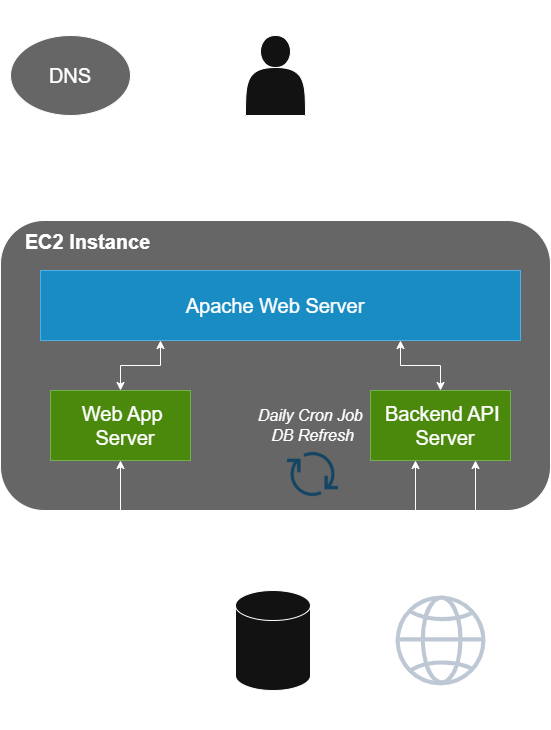

#### 3x5 Trifecta Website README

### Architecture

- trifectafantasyleague.com domain maintained by NameCheap
- DNS redirect via CNAME host to AWS Elastic Load Balancer
- Elastic Load Balancer supports https using SSL termination with a generated cert from Amazon Certificate Manager
- ELB routes traffic to AWS instance, where react server is running and handling requests
- Security group settings only allow traffic through the ELB to reach the react server
- All data is stored on a free tier MongoDB instance
- All AWS resources are operated on the free tier and renewed each year to keep infrastruture costs free
- Proxy node server used to bypass CORS security on Fantrax API and fetch data

### Commissioner Upkeep Actions

- The Commissioner will be responsible for updating certain parameters and variables to allow the website to stay up to date

## Data Updates

# When a new dynasty season starts

Fantrax Data

- Set all divisions
- Change all Head-to-Head matchups for the reguar season
- Complete all offseason trades
- Update carryover FAAB
- Figure out when dynasty playoffs start, and set a phone reminder to set consolation bracket matchups

leagueId

- Using inspect on Fantrax website, find the `leagueId`
- Add the `sportYear` with the `leagueId` to the `leagueIdMappings` object
- Add the `leaguedId` to the `globalVariables.globalVariables.dynasty.inSeasonLeagues` array

teamId

- Using inspect on Fantrax website standings page, under payload method "getStandings", responses[0].data.fantasyTeamInfo, find each team's `teamId`
- Add a new record to the `gmNamesIds` collection with `leagueId`, `sportYear`, and `mappings` using `leagueId` and `teamIds`
- In each GM's record in the "gm" collection, add a key-value pair of `sportYear` to `teamId`

# When dynasty playoffs start

- On Fantrax, set consolation bracket matchups

# When a dynasty season ends

- Remove the `sportYear` from the `globalVariables.globalVariables.dynasty.inSeasonLeagues` array
- Add playoff points to season sport standings

# When a trade occurs

- Manually execute all available aspects of the trade
- Add a new record to the `tradeHistory` collection

## Website Updates

# When a UI and/or proxy server website is needed

- On local machine on merged main branch, at root level `yarn build`
- SSH into AWS instance using key file on local machine
- On EC2 instance, create new folder with today's date `mkdir build-9-30` or `mkdir proxy-server-9-30`
- On local machine, `scp` the local "build/proxy-server" folder to newly created "build/proxy-server" folder on AWS instance
- On EC2 instance, attach to "react" or "proxy" screen
- Kill process
- For new UI build, re-serve new build `serve -s build-9-30/`
- For new proxy server, cd to new proxy-server folder, install node packages, and run proxy server using npm run
- Detach from the screen
- Delete the now oldest folder so that there are 2 copies of "build/proxy-server" folder

## Each year reboot

- Each July, create new gmail account `trifectacommissioner<year>@gmail.com`
- Sign up for free AWS tier
- In November, renew trifectafantasyleague domain
- Create SSL certificate in Amazon Certificate Manager (ACM)
  - In ACM, request a certificate for \*.trifectafantasyleague.com
  - Login to DNS validation (NameCheap) and add CNAME host and target from ACM in order to validate
- Create Load Balancer Security Group
  - Allow inbound traffic rules
    - HTTP on Port 80 from all sources (0.0.0.0/0)
    - HTTPS on Port 443 from all sources (0.0.0.0/0)
  - Modify outbound traffic rule
    - All traffic, all protocol, all port range, destination is EC2 Security Group (go back and fill in after creating EC2 security group)
- Create EC2 Security Group
  - Allow inbound traffic rules
    - SSH on Port 22
    - Custom TCP on Port 3000 from all traffic
    - Custom TCP on Port 3000 from Load Balancer Security Group
- Create Launch Template
  - Specify AMI, instance type, create new key pair, desired capacity
  - Select EC2 security group to use
- Launch Instances from Template (from EC2 instance page)
- Check that webserver is up and reachable from "Public IPv4 DNS" port 3000
- Create Application Load Balancer
  - Internet-facing
  - ipv4
  - Webserver Target Group receiving HTTP traffic on port 3000
  - 2 Listeners: 1) HTTP on Port 80 and 2) HTTPS on Port 443 (SSL termination with ACM cert)
  - Make available in all AZs
  - Select Load Balancer security group
  - Create Target Group for routing traffic target
    - Register Target EC2 instance to the Target Group
- Register Load Balancer domain to DNS targets (NameCheap)
- Check that website is reachable via trifectafantasyleague.com domain
